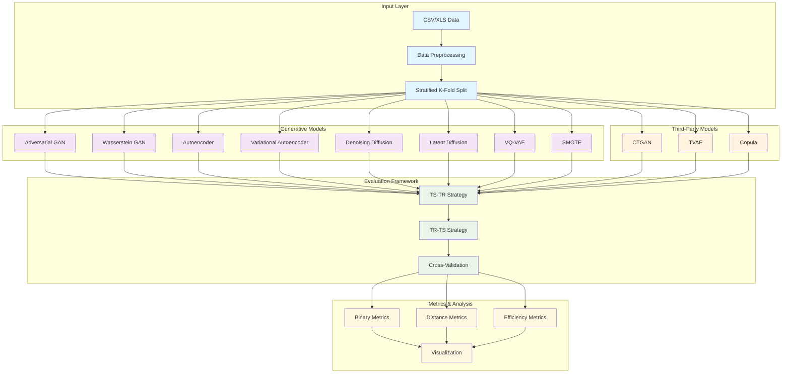

# System Architecture Diagram

This diagram shows the high-level architecture of the MalDataGen framework for synthetic data generation and evaluation.

## Description

The MalDataGen framework follows a modular architecture with four main layers:

1. **Input Layer**: Handles data ingestion from CSV/XLS formats, preprocessing, and stratified k-fold splitting
2. **Generative Models**: Core implementation of 8 different generative algorithms
3. **Third-Party Models**: Integration with SDV library models (CTGAN, TVAE, Copula)
4. **Evaluation Framework**: Implements TS-TR and TR-TS evaluation strategies with cross-validation
5. **Metrics & Analysis**: Comprehensive evaluation metrics and visualization capabilities

The framework supports both native implementations and third-party integrations, providing a comprehensive evaluation pipeline for synthetic data generation. 