# Core Class Hierarchy

This diagram shows the object-oriented architecture and inheritance relationships of the MalDataGen framework.

```mermaid
classDiagram
    class SynDataGen {
        +run_experiments()
        +train_model()
        +synthesize_data()
        +save_data_generated()
        +arguments: Arguments
        +metrics: Metrics
        +evaluation: Evaluation
    }
    
    class GenerativeModels {
        +training_model()
        +get_samples()
        +_get_random_noise()
    }
    
    class AdversarialInstance {
        +_training_adversarial_modelo()
        +_get_adversarial_model()
        +adversarial_number_epochs: int
        +adversarial_batch_size: int
        +adversarial_latent_dimension: int
        +adversarial_activation_function: str
    }
    
    class AutoencoderInstance {
        +_training_autoencoder_model()
        +_get_autoencoder()
        +autoencoder_latent_dimension: int
        +autoencoder_batch_size: int
        +autoencoder_activation_function: str
    }
    
    class VariationalAutoencoderInstance {
        +_training_variational_autoencoder_model()
        +_get_variational_autoencoder()
        +variational_autoencoder_latent_dimension: int
        +variational_autoencoder_batch_size: int
    }
    
    class WassersteinInstance {
        +_training_wasserstein_model()
        +_get_wasserstein()
        +wasserstein_latent_dimension: int
        +wasserstein_batch_size: int
        +wasserstein_discriminator_steps: int
    }
    
    class WassersteinGPInstance {
        +_training_wasserstein_gp_model()
        +_get_wasserstein_gp()
        +wasserstein_gp_latent_dimension: int
        +wasserstein_gp_batch_size: int
    }
    
    class DenoisingDiffusionInstance {
        +_training_denoising_diffusion_model()
        +_get_denoising_diffusion()
        +denoising_diffusion_latent_dimension: int
        +denoising_diffusion_unet_epochs: int
        +denoising_diffusion_gaussian_time_steps: int
    }
    
    class LatentDiffusionInstance {
        +_training_latent_diffusion_model()
        +_get_latent_diffusion()
        +latent_diffusion_latent_dimension: int
        +latent_diffusion_unet_epochs: int
        +latent_diffusion_gaussian_time_steps: int
    }
    
    class QuantizedVAEInstance {
        +_training_quantized_VAE_model()
        +_get_quantized_vae()
        +quantized_vae_latent_dimension: int
        +quantized_vae_number_embeddings: int
        +quantized_vae_batch_size: int
    }
    
    class SmoteInstance {
        +_training_smote_model()
        +_get_smote()
        +smote_sampling_strategy: str
        +smote_k_neighbors: int
    }
    
    class Classifiers {
        +get_trained_classifiers()
        +dictionary_classifiers_name: list
        +_dictionary_classifiers: dict
    }
    
    class Metrics {
        +get_binary_metrics()
        +get_distance_metrics()
        +get_AUC_metric()
        +monitoring_start_training()
        +monitoring_stop_training()
        +save_dictionary_to_json()
    }
    
    class Evaluation {
        +TrTs: TrTs
        +TsTr: TsTr
        +TrTr: TrTr
    }
    
    SynDataGen --> GenerativeModels
    SynDataGen --> Classifiers
    SynDataGen --> Metrics
    SynDataGen --> Evaluation
    
    GenerativeModels --> AdversarialInstance
    GenerativeModels --> AutoencoderInstance
    GenerativeModels --> VariationalAutoencoderInstance
    GenerativeModels --> WassersteinInstance
    GenerativeModels --> WassersteinGPInstance
    GenerativeModels --> DenoisingDiffusionInstance
    GenerativeModels --> LatentDiffusionInstance
    GenerativeModels --> QuantizedVAEInstance
    GenerativeModels --> SmoteInstance
```

## Description

The MalDataGen framework follows a clean object-oriented design with clear separation of concerns:

1. **SynDataGen**: Main orchestrator class that inherits from multiple components
2. **GenerativeModels**: Factory class managing all generative model instances
3. **Model Instances**: Specialized classes for each generative algorithm with specific configurations
4. **Supporting Classes**: Classifiers, Metrics, and Evaluation components for comprehensive analysis

Each model instance encapsulates its specific training logic, hyperparameters, and model architecture, providing a clean and extensible design for adding new generative models. 