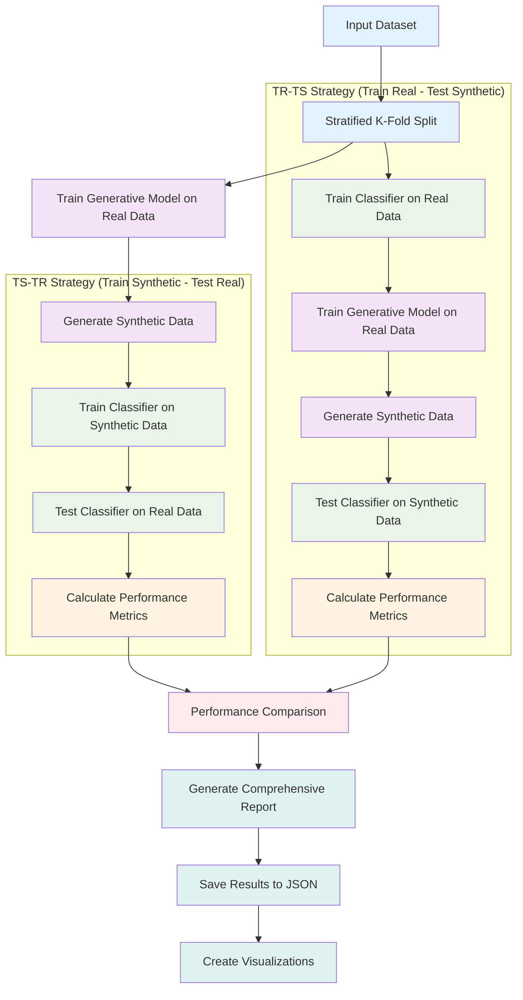

# Evaluation Strategy Flow

This diagram illustrates the two main evaluation strategies used in MalDataGen: TS-TR (Train Synthetic - Test Real) and TR-TS (Train Real - Test Synthetic).

## Description

MalDataGen implements two complementary evaluation strategies to comprehensively assess synthetic data quality:

### TS-TR Strategy (Train Synthetic - Test Real)
- **Purpose**: Measures the generalization ability of synthetic data
- **Process**: 
  1. Train generative model on real data
  2. Generate synthetic samples
  3. Train classifier on synthetic data
  4. Test classifier on real data
- **Interpretation**: High performance indicates synthetic data preserves real data patterns

### TR-TS Strategy (Train Real - Test Synthetic)
- **Purpose**: Assesses the realism and quality of generated data
- **Process**:
  1. Train classifier on real data
  2. Train generative model on real data
  3. Generate synthetic samples
  4. Test classifier on synthetic data
- **Interpretation**: High performance indicates synthetic data is realistic and indistinguishable from real data

### Cross-Validation Integration
Both strategies are executed using stratified k-fold cross-validation to ensure robust and reliable evaluation results across multiple data splits. 
