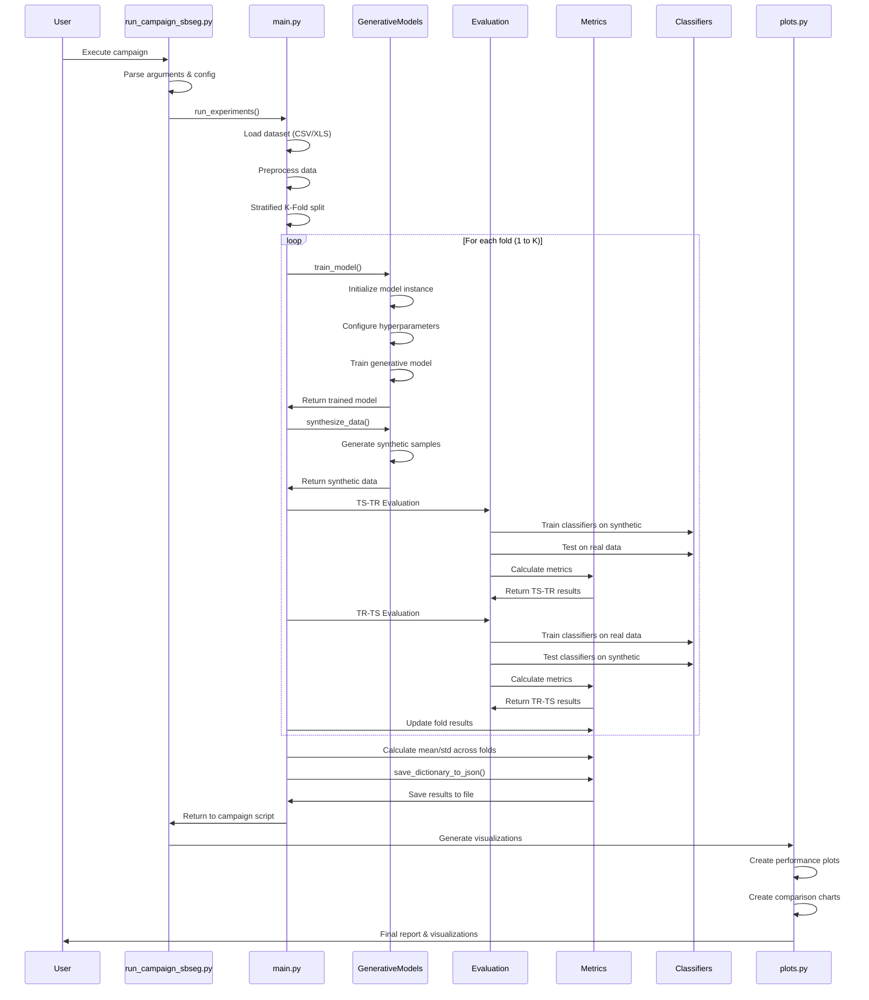

# Model Training Pipeline

This sequence diagram shows the complete workflow of the MalDataGen framework from data loading to final results generation.

## Description

The MalDataGen training pipeline follows a systematic approach:

### 1. Campaign Initialization
- User executes `run_campaign_sbseg.py` with specific configuration
- Campaign script parses arguments and sets up experiment parameters
- Calls the main experiment runner

### 2. Data Preparation
- Loads dataset from CSV/XLS format
- Applies preprocessing (normalization, encoding, etc.)
- Performs stratified k-fold splitting to maintain class distribution

### 3. Model Training Loop
For each fold:
- **Model Training**: Initializes and trains the specified generative model
- **Data Generation**: Creates synthetic samples using the trained model
- **Classifier Training**: Trains multiple classifiers on real data
- **TS-TR Evaluation**: Tests synthetic data quality by training on synthetic, testing on real
- **TR-TS Evaluation**: Tests synthetic data realism by training on real, testing on synthetic

### 4. Results Aggregation
- Calculates mean and standard deviation across all folds
- Saves comprehensive results to JSON format
- Generates publication-ready visualizations

### 5. Output Generation
- Creates performance comparison plots
- Generates statistical analysis reports
- Provides both numerical and visual results

This pipeline ensures robust evaluation through cross-validation and provides comprehensive insights into synthetic data quality. 
