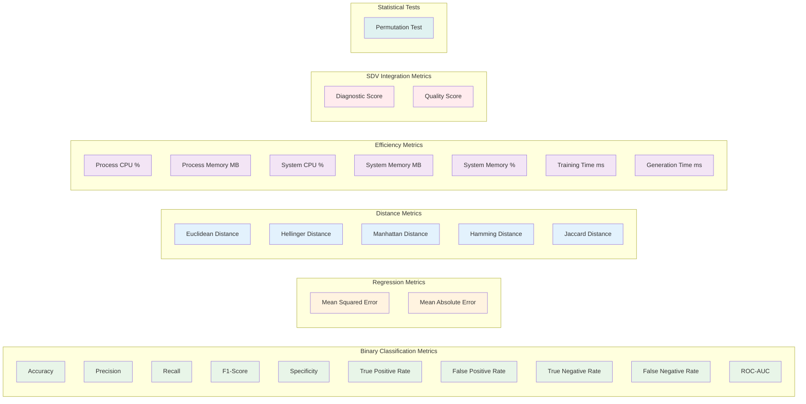

# Metrics Framework

This diagram shows the comprehensive metrics framework used in MalDataGen for evaluating synthetic data quality and model performance.

## Description

MalDataGen implements a comprehensive metrics framework covering multiple evaluation dimensions:

### Binary Classification Metrics
- **Core Metrics**: Accuracy, Precision, Recall, F1-Score, Specificity
- **Rate Metrics**: TPR, FPR, TNR, FNR for detailed performance analysis
- **Advanced Metrics**: ROC-AUC for overall model performance assessment

### Regression Metrics
- **Error Metrics**: MSE and MAE for continuous value prediction evaluation
- **Purpose**: Assess model performance on regression tasks within the framework

### Distance Metrics
- **Distribution Comparison**: Euclidean, Hellinger, Manhattan distances
- **Categorical Comparison**: Hamming and Jaccard distances for discrete data
- **Purpose**: Measure similarity between real and synthetic data distributions

### Efficiency Metrics
- **Resource Monitoring**: CPU and memory usage tracking
- **Performance Timing**: Training and generation time measurements
- **Purpose**: Assess computational efficiency and resource requirements

### SDV Integration Metrics
- **Diagnostic Score**: Overall synthetic data quality assessment
- **Quality Score**: Statistical quality evaluation
- **Purpose**: Leverage industry-standard synthetic data evaluation

### Statistical Tests
- **Permutation Test**: Statistical significance testing
- **Purpose**: Validate the statistical validity of results

This multi-dimensional approach ensures comprehensive evaluation of synthetic data quality, model performance, and computational efficiency. 