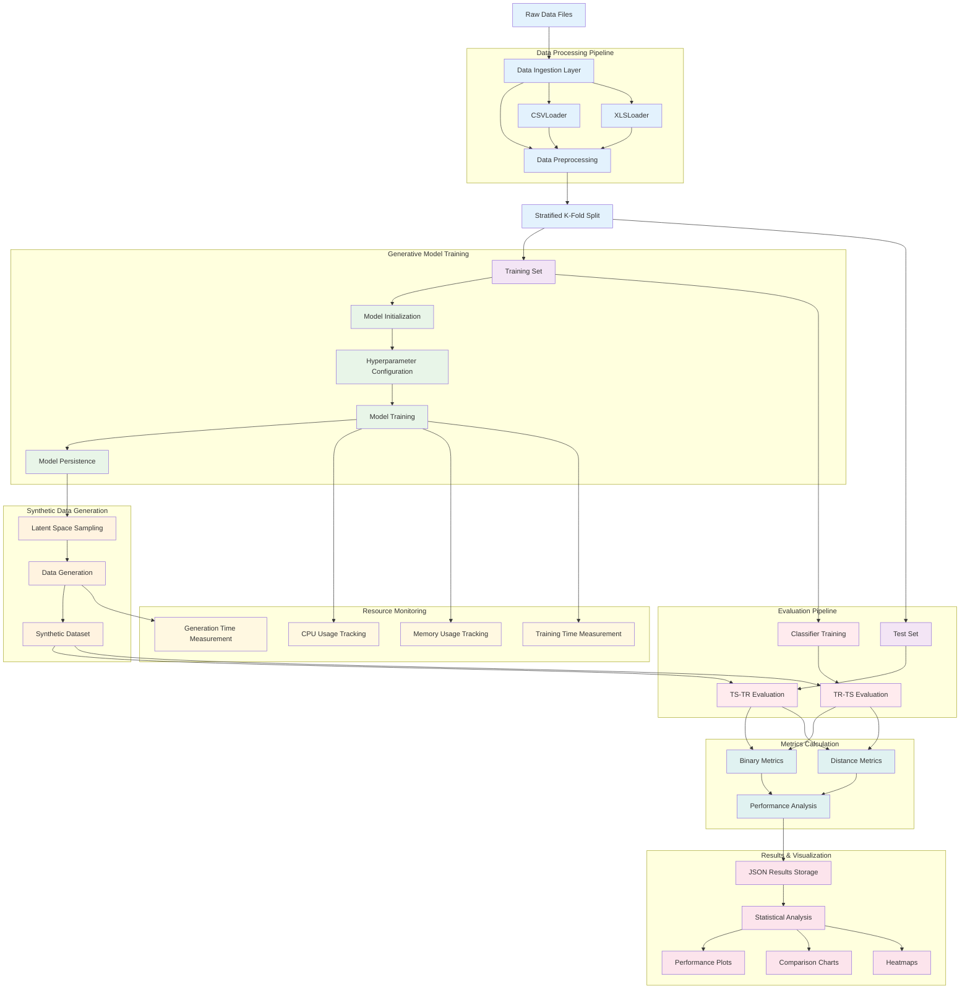

# Data Flow Architecture

This diagram illustrates the complete data flow through the MalDataGen framework, from raw data ingestion to final results generation.

## Description

The MalDataGen data flow architecture follows a systematic pipeline:

### 1. Data Ingestion & Preprocessing
- **Input**: Raw CSV/XLS files containing tabular data
- **Loaders**: Specialized CSVLoader and XLSLoader for format handling
- **Preprocessing**: Data cleaning, normalization, and encoding
- **Splitting**: Stratified k-fold split maintaining class distribution

### 2. Generative Model Pipeline
- **Initialization**: Model-specific configuration and setup
- **Training**: Iterative training with hyperparameter optimization
- **Persistence**: Model saving for reproducibility
- **Generation**: Synthetic data creation through latent space sampling

### 3. Evaluation Framework
- **TS-TR**: Train on synthetic, test on real data
- **TR-TS**: Train on real, test on synthetic data
- **Cross-validation**: Robust evaluation across multiple folds

### 4. Metrics & Analysis
- **Binary Metrics**: Classification performance evaluation
- **Distance Metrics**: Distribution similarity assessment
- **Performance Analysis**: Comprehensive statistical analysis

### 5. Results & Visualization
- **Storage**: JSON format for structured results
- **Visualization**: Performance plots, comparison charts, heatmaps
- **Reporting**: Publication-ready visualizations and analysis

### 6. Resource Monitoring
- **Efficiency Tracking**: CPU, memory, and timing measurements
- **Performance Optimization**: Resource usage analysis for scalability

This architecture ensures data integrity, reproducibility, and comprehensive evaluation throughout the entire pipeline. 