# Generative Models Comparison

This diagram provides a comprehensive comparison of all generative models supported by the MalDataGen framework, highlighting their key characteristics and use cases.

```mermaid
graph TB
    subgraph "Adversarial Models"
        A1[Adversarial GAN]
        A2[Wasserstein GAN]
        A3[Wasserstein GP GAN]
    end
    
    subgraph "Autoencoder Models"
        B1[Autoencoder]
        B2[Variational Autoencoder]
        B3[Quantized VAE]
    end
    
    subgraph "Diffusion Models"
        C1[Denoising Diffusion]
        C2[Latent Diffusion]
    end
    
    subgraph "Statistical Models"
        D1[SMOTE]
    end
    
    subgraph "Third-Party Models"
        E1[CTGAN]
        E2[TVAE]
        E3[Copula]
    end
    
    subgraph "Model Characteristics"
        F1[Conditional Generation]
        F2[Probabilistic Sampling]
        F3[Discrete Latent Space]
        F4[Progressive Generation]
        F5[Interpolation-based]
        F6[Statistical Dependencies]
    end
    
    A1 --> F1
    A2 --> F1
    A3 --> F1
    B1 --> F2
    B2 --> F2
    B3 --> F3
    C1 --> F4
    C2 --> F4
    D1 --> F5
    E1 --> F1
    E2 --> F2
    E3 --> F6
    
    style A1 fill:#f3e5f5
    style A2 fill:#f3e5f5
    style A3 fill:#f3e5f5
    style B1 fill:#e8f5e8
    style B2 fill:#e8f5e8
    style B3 fill:#e8f5e8
    style C1 fill:#fff3e0
    style C2 fill:#fff3e0
    style D1 fill:#e3f2fd
    style E1 fill:#ffebee
    style E2 fill:#ffebee
    style E3 fill:#ffebee
    style F1 fill:#fce4ec
    style F2 fill:#fce4ec
    style F3 fill:#fce4ec
    style F4 fill:#fce4ec
    style F5 fill:#fce4ec
    style F6 fill:#fce4ec
```

## Model Categories and Characteristics

### Adversarial Models (GANs)
- **Adversarial GAN**: Classic GAN with generator-discriminator architecture
- **Wasserstein GAN**: Improved stability using Wasserstein distance
- **Wasserstein GP GAN**: Enhanced with gradient penalty for better convergence
- **Key Feature**: Conditional generation with adversarial training

### Autoencoder Models
- **Autoencoder**: Basic compression-reconstruction architecture
- **Variational Autoencoder**: Probabilistic latent space with KL divergence
- **Quantized VAE**: Discrete latent representations via vector quantization
- **Key Feature**: Probabilistic sampling from learned latent space

### Diffusion Models
- **Denoising Diffusion**: Progressive noise-based generation
- **Latent Diffusion**: Diffusion in compressed latent space
- **Key Feature**: Progressive generation through noise scheduling

### Statistical Models
- **SMOTE**: Synthetic Minority Over-sampling Technique
- **Key Feature**: Interpolation-based oversampling for class balance

### Third-Party Models (SDV Integration)
- **CTGAN**: Conditional GAN optimized for tabular data
- **TVAE**: Tabular Variational Autoencoder
- **Copula**: Statistical model based on dependency functions
- **Key Feature**: Industry-standard implementations with specialized optimizations

## Use Case Recommendations

- **Class Imbalance**: SMOTE, Conditional GANs
- **High-Quality Generation**: Diffusion Models, VAE variants
- **Tabular Data**: CTGAN, TVAE, Copula
- **Discrete Features**: Quantized VAE
- **Stability**: Wasserstein variants
- **Efficiency**: Autoencoders, SMOTE 