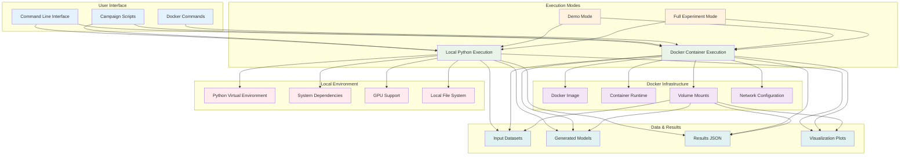

# Deployment Architecture

This diagram shows the deployment options and execution modes available for the MalDataGen framework, including Docker containerization and local execution.



## Deployment Options

### Local Execution
- **Python Environment**: Virtual environment with pip dependencies
- **System Requirements**: Python 3.8+, CUDA 11+ (optional)
- **Execution**: Direct Python script execution
- **Advantages**: Full system access, GPU acceleration, easy debugging

### Docker Containerization
- **Base Image**: Ubuntu 22.04 with Python 3.8+
- **Dependencies**: Pre-installed via requirements.txt
- **Volume Mounts**: Data and results persistence
- **Advantages**: Reproducible environment, isolation, easy distribution

## Execution Modes

### Demo Mode
- **Purpose**: Quick testing and demonstration
- **Duration**: ~3 minutes
- **Scope**: Reduced dataset, single model type
- **Command**: `python3 run_campaign_sbseg.py -c sf`

### Full Experiment Mode
- **Purpose**: Complete research evaluation
- **Duration**: ~7 hours
- **Scope**: All models, comprehensive evaluation
- **Command**: `python3 run_campaign_sbseg.py`

## Docker Commands

```bash
# Demo execution
./run_demo_docker.sh

# Full experiments
./run_experiments_docker.sh

# Manual Docker execution
docker build -t maldatagen .
docker run -v $(pwd)/datasets:/MalDataGen/datasets maldatagen
```

## File Structure

```
MalDataGen/
├── main.py                    # Core framework
├── run_campaign_sbseg.py      # Campaign orchestrator
├── Dockerfile                 # Container definition
├── requirements.txt           # Python dependencies
├── run_demo_docker.sh         # Demo execution script
├── run_experiments_docker.sh  # Full experiment script
├── Datasets/                  # Input data directory
├── Results/                   # Output results directory
└── Docs/Diagrams/             # Architecture documentation
```

## Resource Requirements

### Minimum Requirements
- **CPU**: Any x86_64 processor
- **RAM**: 4 GB
- **Storage**: 10 GB
- **GPU**: Optional (NVIDIA with CUDA 11+)

### Recommended Requirements
- **CPU**: Multi-core (i5/Ryzen 5+)
- **RAM**: 8 GB+
- **Storage**: 20 GB SSD
- **GPU**: NVIDIA with CUDA 11+ for acceleration

## Security Considerations

- **Local Execution**: No security concerns
- **Docker Execution**: Requires sudo permissions for Docker engine
- **Data Privacy**: All processing occurs locally or within container
- **Network**: No external network access required 