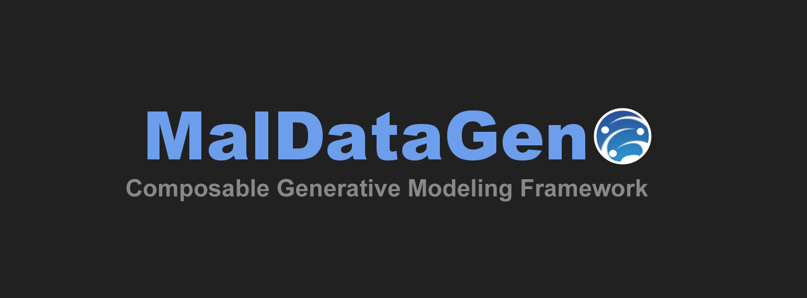

[]()

<div align="center">
  
  
  
  
  
  
  <div>
    
    
    <a href="https://github.com/kayua/SynDataGen/actions?query=branch%3Amain">
      
    </a>
  </div>
</div>


# 🌊 MalDataGen - v.1.0.0 (Jellyfish 🪼)

MalDataGen is an advanced Python framework for generating and evaluating synthetic tabular datasets using modern generative models, including diffusion and adversarial architectures. Designed for researchers and practitioners, it provides reproducible pipelines, fine-grained control over model configuration, and integrated evaluation metrics for realistic data synthesis.

---

## 📚 Table of Contents/Estrutura do readme.md

 
- [📖 Overview/ Informações básicas](#overview)
- [Video](#overview)
- [Security worries](#securty_worries)
- [Stamps considered/Selos Considerados](#stamps)
- [🚀 Getting Started](#getting-started)
- [⚙️ Installation/Instalação](#installation)
- [🧠 Architectures](#architectures)
- [🛠 Features](#features)
- [📊 Evaluation Strategy](#evaluation)
- [📈 Metrics](#metrics)
- [🔧 Technologies Used/Dependências](#technologies)
- [🔗 References](#references)
  

---

## 📖 Overview /Informações básicas <a name="overview"></a>

Synthetic Ocean is a modular and extensible synthetic data generation library for tabular domains. It aims to:

- Support state-of-the-art generative models (GANs, VAEs, Diffusion, etc.)
- Improve model generalization by augmenting training data
- Enable fair benchmarking via reproducible evaluations (TS-TR and TR-TS)
- Provide publication-ready metrics and visualizations

It supports GPU acceleration, CSV/XLS ingestion, custom CLI scripts, and integration with academic pipelines.
--- 
## 📖 Video <a name="Video"></a>
The following link showcases a video of a demonstration of the tool: https://drive.google.com/file/d/1sbPZ1x5Np6zolhFvCBWoMzqNqrthlUe3/view?usp=sharing

if that doesn't work we have a backup on: https://youtu.be/t-AZtsLJUlQ

---


## Stamps considered <a name="stamps"></a>

We, the authors, consider the following stamps:

  - Available artifacts (Stamp D)

  - Functional artifacts (Stamp F)

  - Sustainable artifacts (Stamp S)

  - Reproducible experiments (Stamp R)

We provide instructions for the installation, execution, and reproduction of the experiments presented in the paper, along with information about the execution environment and dependencies.

## 🚀 Getting Started <a name="getting-started"></a>

### Prerequisites

- Python 3.8+
- pip
- (Optional) CUDA 11+ for GPU acceleration

### Optional: Create a virtual environment

```bash
pip install virtualenv
python3 -m venv ~/Python3venv/MalDataGen
source ~/Python3venv/MalDataGen/bin/activate
```

---

## ⚙️ Installation <a name="installation"></a>

```bash
git clone https://github.com/SBSeg25/MalDataGen.git
cd MalDataGen
pip install --upgrade pip
pip install -r requirements.txt
# or
pip install .
```
## Security worries /Preocupações com segurança <a name="securty_worries"></a>

#### We declare that the local execution of experiments has no security worries, however the docker executing require sudo permissions being available to the docker engine.

 
### 🚀 Run Tests

#### Demo/Teste mínimo
In order to execute a demo of the tool, utilized the comand listed below. The execution of this reduced demo takes around 3 minutes on a AMD Ryzen 7 5800x, 8 cores, 64 GB RAM machine.
 
```bash
# Run the basic demo
python3 run_campaign_sbseg.py -c sf
```

Alternatively, you can use the a docker container to execute the demo, by using the following comand:

```bash
# Run the basic demo
./run_demo_docker.sh 
```


#### Reproduction/Experimentos
In order to reproduce the results from the paper execute the comand below, the experiments take around 7 hours on a AMD Ryzen 7 5800x, 8 cores, 64 GB RAM machine.

```bash
# Run all experiments from the paper
python3 run_campaign_sbseg.py 
```

Or to execute with docker:
```bash
# Run all experiments from the paper
./run_experiments_docker.sh  
```

---

## 🧠 Architectures Supported <a name="architectures"></a>

### 🔨 Native Models
| Model                 | Description                                                                 | Use Case                                    |
|-----------------------|-----------------------------------------------------------------------------|---------------------------------------------|
| `CGAN`                | Conditional GANs conditioned on labels or attributes                        | Class balancing, controlled generation      |
| `WGAN`                | Wasserstein GAN with Earth-Mover distance for improved stability            | Imbalanced datasets, stable training        |
| `WGAN-GP`             | Wasserstein GAN with gradient penalty for stable training                   | Imbalanced datasets, complex distributions  |
| `Autoencoder`         | Latent-space learning through compression-reconstruction                    | Feature extraction, denoising               |
| `VAE`                 | Probabilistic Autoencoder with latent sampling                              | Probabilistic generation and imputation     |
| `Denoising Diffusion` | Progressive noise-based generative model                                    | Robust generation with high-quality samples |
| `Latent Diffusion`    | Diffusion model operating in compressed latent space                        | High-resolution generation, efficiency      |
| `VQ-VAE`              | Discrete latent-space via quantization                                      | Categorical and mixed-type data             |
| `SMOTE`               | Synthetic Minority Over-sampling Technique (interpolation-based)            | Class imbalance in tabular data             |


### 📦 Third-Party Supported (SDV)
| Model       | Description                                                                 | Use Case                              |
|-------------|-----------------------------------------------------------------------------|---------------------------------------|
| `TVAE`      | Variational Autoencoder optimized for tabular data                          | Structured/tabular data synthesis     |
| `Copula`    | Statistical model based on dependency (copula) functions                    | Synthetic data with correlations      |
| `CTGAN`     | GAN with mode-specific normalization for tabular data                       | Mixed-type/categorical synthesis      |

*Legenda*:  
- **SDV**: Integração com a biblioteca [Synthetic Data Vault](https://sdv.dev/).
---

## 🛠 Features <a name="features"></a>

- 📊 Cross-validation (stratified k-fold)
- ⚙️ Fully customizable model configuration
- 📈 Built-in metrics for data quality
- 🔁 Persistent models & experiment saving
- 📉 Graphing utilities for visual reports
- 📉 Clustering visualization of datasets
- 📉 Heat maps between the synthetic and real samples
- 🧪 Automated experiment pipelines
- 💾 Data export to CSV/XLS formats

---

## 📊 Evaluation Strategy <a name="evaluation"></a>

Two validation approaches are supported:

- **TS-TR (Train Synthetic – Test Real)**  
  Measures generalization ability by training on synthetic data and testing on real data.

- **TR-TS (Train Real – Test Synthetic)**  
  Assesses generative realism by training on real and testing on synthetic samples.

---

## 📈 Metrics Tracked <a name="metrics"></a>

### Primary

- Accuracy, Precision, Recall, F1-score, Specificity
- ROC-AUC, MSE, MAE, FNR, TNR

### Secondary

- Euclidean Distance, Hellinger Distance
- Log-Likelihood, Manhattan Distance

---


---

## 🧰 Technologies Used <a name="technologies"></a>

| Tool          | Purpose                     |
|---------------|-----------------------------|
| Python 3.8+   | Core language               |
| NumPy, Pandas | Data processing             |
| TensorFlow    | Model building              |
| Matplotlib, Plotly | Visualization          |
| PyTorch (planned) | Future multi-backend support |
| Docker        | Containerization            |
| Git           | Version control             |

---

## 🔬 System Requirements

### Hardware

| Component | Minimum    | Recommended             |
|----------|------------|--------------------------|
| CPU      | Any x86_64 | Multi-core (i5/Ryzen 5+) |
| RAM      | 4 GB       | 8 GB+                    |
| Storage  | 10 GB      | 20 GB SSD                |
| GPU      | Optional   | NVIDIA with CUDA 11+     |

### Software

| Component | Version    | Notes                    |
|-----------|------------|--------------------------|
| OS        | Ubuntu 22.04+ | Linux preferred       |
| Python    | ≥ 3.8.10   | Virtualenv recommended   |
| Docker    | ≥ 27.2.1   | Optional but supported   |
| Git       | Latest     | Required                 |
| CUDA      | ≥ 11.0     | Optional for GPU execution |

---

## 🔗 References <a name="references"></a>

### Core Papers
- [Kingma, D. P., & Welling, M. (2013). Auto-Encoding Variational Bayes](https://arxiv.org/abs/1312.6114)  
- [Goodfellow, I. et al. (2014). Generative Adversarial Nets](https://arxiv.org/abs/1406.2661)  
- [Ho, J. et al. (2020). Denoising Diffusion Probabilistic Models](https://arxiv.org/abs/2006.11239)  
- [Oord, A. v. d. et al. (2017). Neural Discrete Representation Learning](https://arxiv.org/abs/1711.00937)  
- [Arjovsky, M. et al. (2017). Wasserstein GAN](https://arxiv.org/abs/1701.07875)  

### SDV Ecosystem
- [Patki, N. et al. (2016). The Synthetic Data Vault](https://arxiv.org/abs/1811.11264)  
- [Xu, L. et al. (2019). Modeling Tabular Data using Conditional GAN](https://arxiv.org/abs/1907.00503)  

### Supplementary
- [Mirza, M. & Osindero, S. (2014). Conditional Generative Adversarial Nets](https://arxiv.org/abs/1411.1784)  
- [Gulrajani, I. et al. (2017). Improved Training of Wasserstein GANs](https://arxiv.org/abs/1704.00028)  


## 🧩 License

Distributed under the MIT License. See LICENSE for more information.
